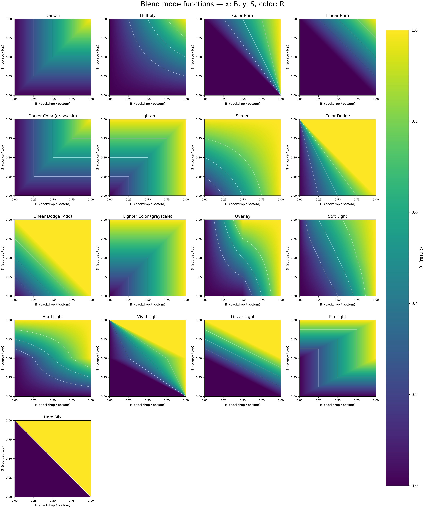

# Blend Mode Function Atlas / 混合模式函数图谱

A verified visual reference for 17 common image blend-mode functions. Each map uses backdrop `B` on the horizontal axis, source `S` on the vertical axis, and a shared color scale for result `R`.

这是一个经过数值校验的混合模式函数图谱，包含 17 种常见模式。每张图以底层 `B` 为横轴、上层 `S` 为纵轴，并用统一色标表示输出 `R`。



## Included / 内容

- High-resolution overview and individual maps / 高分辨率总览与单图
- Bilingual Chinese-English PDF atlas / 中英文对照 PDF 图谱
- Explicit piecewise formulas and boundary behavior / 明确的分段公式与边界行为
- Automated checks on critical points and the full sampled grid / 关键点与完整采样网格的自动校验

The implementation pays special attention to Overlay, Soft Light, Hard Light, Vivid Light, Pin Light, Hard Mix, Color Burn, and Color Dodge. Arithmetic outputs are clamped to `[0,1]` where required.

实现中特别核对了 Overlay、Soft Light、Hard Light、Vivid Light、Pin Light、Hard Mix、Color Burn 与 Color Dodge，并在需要时将算术结果截断到 `[0,1]`。

## Repository layout / 仓库结构

```text
src/                           reproducible generators / 可复现生成脚本
figures/                       overview and individual maps / 总览与单图
docs/                          PDF atlas and verification notes / PDF 与校验说明
requirements.txt               Python dependencies / Python 依赖
```

## Reproduce / 重新生成

```bash
python -m pip install -r requirements.txt
python src/generate_blend_mode_maps.py
python src/build_bilingual_pdf.py
```

Both scripts resolve paths relative to their own location in the packaged repository. Python 3.10 or newer is recommended.

两个脚本均以仓库内路径工作。建议使用 Python 3.10 或更高版本。

## Notes / 说明

`Darker Color` and `Lighter Color` compare whole RGB pixels. Their scalar grayscale maps reduce to `Darken` and `Lighten`, which is how they are represented here.

`Darker Color` 与 `Lighter Color` 在 RGB 图像中比较整像素。本项目中的二维标量图展示灰度情形，此时它们分别等同于 `Darken` 与 `Lighten`。
